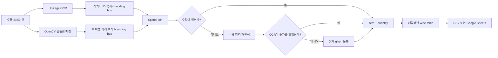
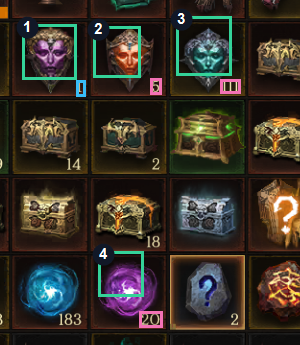

# RPG Progress OCR Logger

수동으로 캡처한 RPG 인벤토리 화면에서 캐릭터 ID와 관심 재화를 읽어,
캐릭터별 한 행의 진척도 데이터로 정리하는 프로젝트입니다.

게임 클라이언트를 조작하지 않습니다. 사용자가 플레이를 마친 뒤 직접
캡처한 화면만 읽는 **read-only 파이프라인**입니다.

## 해결하려던 문제

캐릭터가 늘어나면서 인벤토리 상태를 확인하고 표에 옮기는 일이 반복됐습니다.
문장, 보석 마력, 거래 가능한 일반 보석이 서로 다른 화면에 있어 캐릭터
하나를 기록하는 데도 여러 번 화면을 확인해야 했습니다.

처음에는 OCR로 숫자를 읽으면 해결될 것이라 생각했습니다. 실제로 OCR은
`81`, `209`, `126` 같은 값을 잘 읽었습니다. 그러나 한 화면에는 장비 레벨,
재화, 아이템 수량 등 많은 숫자가 함께 있었고, OCR 결과만으로는
**어떤 숫자가 어떤 아이템의 수량인지 알 수 없었습니다.**

일반 보석에는 한 가지 조건이 더 있었습니다. 색상과 외형이 같아도 좌측
상단의 거래 가능 표식이 있는 보석만 기록해야 했습니다.

이 프로젝트에서 해결한 핵심은 문자 인식 자체보다 다음 관계를 복원하는
일이었습니다.

```text
화면의 숫자
→ 숫자의 좌표
→ 아이템과 거래 표식의 좌표
→ 같은 셀에 있는 값끼리 연결
→ 캐릭터별 진척도 행으로 집계
```

## 전체 흐름



## 기술을 나눈 이유

### Upstage OCR

캐릭터 ID와 수량뿐 아니라 단어별 bounding box를 얻기 위해 사용했습니다.
숫자의 위치가 있어야 아이템과의 거리나 같은 셀 여부를 계산할 수 있습니다.

### Upstage Document Parse

인벤토리 그리드를 문서 구조처럼 해석할 수 있는지 OCR과 비교했습니다.
텍스트는 추출할 수 있었지만, 아이템 이름이 적혀 있지 않고 색상·아이콘·작은
표식에 의미가 담긴 게임 UI에서는 숫자와 아이템의 관계를 안정적으로
복원하지 못했습니다.

Document Parse는 OCR과의 차이를 확인하는 비교 경로로 남기고, 실제 수량
연결에는 OCR 좌표와 컴퓨터 비전을 사용했습니다.

### OpenCV

문장, 보석 마력, 일반 보석, 거래 가능 표식의 위치를 찾습니다. OCR 숫자와
아이템 bounding box를 spatial join해 최종 수량을 결정합니다.

## 아이템과 수량을 연결한 방법

문장과 보석 마력은 템플릿이 매칭된 아이콘의 오른쪽 아래에서 가장 가까운
OCR 숫자를 찾습니다.

일반 보석은 순서가 다릅니다.

1. 거래 가능 표식을 탐지합니다.
2. 표식이 속한 인벤토리 셀을 계산합니다.
3. 같은 셀에서 색상별 보석 템플릿을 비교합니다.
4. 셀의 오른쪽 아래에 있는 OCR 숫자를 연결합니다.

단순히 가장 아래에 있는 숫자를 선택했을 때는 옆 셀의 수량이 연결되는
실패가 있었습니다. 같은 높이에 숫자가 여러 개라면 더 오른쪽에 있는 값을
우선하도록 바꿔 인접 셀 오연결을 해결했습니다.

### 문장과 미귀속 보석 마력



- 초록색: 템플릿으로 찾은 아이템
- 자주색: Upstage OCR이 읽은 숫자 bounding box
- 하늘색: OCR이 놓친 숫자를 분리한 glyph 영역

| 번호 | 아이템 | 최종 수량 | 수량 인식 경로 | 템플릿 점수 |
| ---: | --- | ---: | --- | ---: |
| 1 | 영원의 전설 문장 | 1 | 숫자 glyph | 0.9739 |
| 2 | 전설 문장 | 5 | Upstage OCR | 0.9835 |
| 3 | 희귀 문장 | 111 | Upstage OCR | 0.9747 |
| 4 | 미귀속 보석 마력 | 20 | Upstage OCR | 0.9938 |

### 거래 가능한 일반 보석


초록색 박스는 거래 가능 표식이 있는 셀에서 분류한 보석이고, 자주색 박스는
연결된 수량입니다. 같은 종류의 귀속 보석은 기록에서 제외됩니다.

## OCR이 놓친 한 자리 숫자

가장 오래 남은 문제는 화면에 선명하게 보이는 `1`과 `4`를 Upstage OCR이
반환하지 않는 경우였습니다.

다음 방법을 차례로 확인했습니다.

- 전체 화면 OCR
- 아이템 셀의 수량 영역만 crop한 OCR
- crop 4배 확대
- grayscale·이진화 전처리
- Document Parse

`1280x720`의 `1`은 수량 영역 OCR에서 읽혔지만, 신규 `960x540` 화면의
`4`는 모든 OCR·Document Parse 경로에서 빈 응답이었습니다. 아이콘이
있다는 이유로 수량을 `1`이나 `4`라고 추측할 수는 없었습니다.

최종적으로 숫자 영역에서 배경과 테두리에 연결되지 않은 glyph component를
분리하고 `32x48` 크기로 정규화했습니다. 이후 로컬 숫자 템플릿과 비교해
다음 조건을 모두 만족할 때만 값을 확정합니다.

- 최고 매칭 점수가 임계값 이상
- 최고 점수와 2위 점수 사이에 충분한 차이가 있음
- 조건을 만족하지 못하면 `needs_review` 유지

`2-2` 화면에서 만든 숫자 `4` 템플릿을 다른 캐릭터의 `3-2`, `4-2`,
`5-2`에 교차 적용해 네 화면 모두 `4`로 분류했습니다. 기존 숫자 `1`도
같은 파이프라인에서 유지됐습니다.

## 해상도와 UI 차이

초기 템플릿은 `960x540` 화면에서 만들었고, 이후 `1280x720` 화면이
추가됐습니다. 기준 화면 폭을 `960px`로 두고 현재 화면 폭과의 비율만큼
템플릿 크기와 공간 탐색 거리를 함께 조정했습니다.

모든 화면에 같은 템플릿을 적용하면서 비슷한 장식이 낮은 점수로 잡히는
경우도 확인했습니다. 실제 대상과 오탐의 점수 분포를 비교해 존재 임계값을
정했고, 값은 코드에 흩어두지 않고 `ScannerProfile`로 분리했습니다.

새 UI에서는 `calibrate` 명령으로 기대 수량을 입력하지 않은 채 템플릿별
최고 점수와 좌표를 확인할 수 있습니다.

## 검증 결과

신규 캐릭터 4명의 화면을 각 3장씩, 총 12장 추가해 같은 파이프라인으로
검증했습니다.

| 캐릭터 ID | 영원의 전설 문장 | 전설 문장 | 희귀 문장 | 보석 마력 | 전기석 | 루비 | 황수정 | 토파즈 | 사파이어 | 남옥 |
| --- | ---: | ---: | ---: | ---: | ---: | ---: | ---: | ---: | ---: | ---: |
| 게임ID 1 | 4 | 16 | 209 | 79 | 81 | 37 | 88 | 93 | 27 | 94 |
| 게임ID 2 | 4 | 15 | 205 | 32 | 78 | 41 | 79 | 79 | 41 | 91 |
| 게임ID 3 | 4 | 16 | 209 | 126 | 85 | 33 | 75 | 76 | 51 | 82 |
| 게임ID 4 | 4 | 16 | 208 | 21 | 65 | 43 | 89 | 98 | 28 | 94 |

- 캐릭터 ID: `4/4`
- 목표 수량: `40/40`
- 검토 상태: 네 캐릭터 모두 `확인 완료`
- 자동화 테스트: `23 passed`

위 결과는 추가한 로컬 데이터에서 확인한 값이며, 일반화된 정확도 지표로
표현하지 않았습니다.

## 캐릭터별 한 행으로 집계

세 장의 스캔 결과는 `캐릭터 ID + 세션 ID`를 기준으로 한 행에 합쳐집니다.
화면에서 아이템 순서가 달라져도 이름을 기준으로 정해진 열에 들어갑니다.

```text
기록시각
세션 ID
캐릭터 ID
영원의 전설 문장
전설 문장
희귀 문장
미귀속 보석 마력
미귀속 전기석
미귀속 루비
미귀속 황수정
미귀속 토파즈
미귀속 사파이어
미귀속 남옥
검토 상태
```

같은 세션 ID와 캐릭터 ID가 이미 Google Sheets에 있으면 해당 행을
갱신하고, 없을 때만 새 행을 추가합니다. Google 인증 없이 wide CSV만
생성할 수도 있습니다.

Sheets API 호출은 mock service로 테스트했습니다. 실제 사용자 Google
계정에 대한 통합 쓰기는 인증과 외부 데이터 변경이 필요해 별도로
검증해야 합니다.

## 테스트 전략

실제 스크린샷과 템플릿에는 게임 UI와 캐릭터 정보가 포함될 수 있어
Public 저장소에 올리지 않습니다.

대신 테스트 실행 중 작은 합성 이미지와 OCR bounding box를 만들어 다음
동작을 검증합니다.

- 분리된 캐릭터 ID 조각 결합
- 아이템과 수량 spatial join
- 같은 줄에서 오른쪽 수량 우선 선택
- 거래 가능 표식과 일반 보석 분류
- `960px`·`1280px` 템플릿 크기 보정
- OCR 누락과 숫자 glyph 분류
- 프로필 유효성 검사
- wide-table 병합과 값 충돌 처리
- Google Sheets append·update 분기

```bash
python -m pytest
```

현재 결과는 **23 passed**입니다.

## 실행 방법

Python 3.10 이상이 필요합니다.

```bash
python -m pip install -e ".[dev]"
```

### OCR 응답 캐시

```bash
rpg-progress-ocr-logger ocr-images examples/2-1.png examples/2-2.png \
  --out-dir local_outputs/upstage_ocr
```

### 인벤토리 스캔

```bash
rpg-progress-ocr-logger scan examples/2-2.png \
  --ocr-json local_outputs/upstage_ocr/2-2.json \
  --templates local_templates \
  --refine-missing-quantities \
  --digit-templates local_templates/digits \
  --out local_outputs/2-2.json
```

### 템플릿 점수 보정

```bash
rpg-progress-ocr-logger calibrate examples/2-2.png \
  --templates local_templates \
  --profile scanner-profile.json \
  --out local_outputs/calibration.json
```

### 캐릭터별 CSV

```bash
rpg-progress-ocr-logger export-wide local_outputs/2-*.json \
  --captured-at 2026-06-27T20:00:00+09:00 \
  --session-id 20260627-evening \
  --out local_outputs/inventory-wide.csv
```

### Google Sheets

```bash
python -m pip install -e ".[sheets]"
rpg-progress-ocr-logger export-sheets local_outputs/2-*.json \
  --captured-at 2026-06-27T20:00:00+09:00 \
  --session-id 20260627-evening \
  --spreadsheet-id YOUR_SHEET_ID
```

## 저장소 구조

```text
src/rpg_progress_ocr_logger/
  cli.py                 CLI 명령
  upstage_client.py      OCR·Document Parse API와 429 재시도
  inventory_scanner.py   템플릿 매칭과 spatial join
  quantity_reader.py     수량 crop OCR과 숫자 glyph 분류
  profile.py             스캐너 설정과 검증
  inventory_export.py    wide CSV와 Google Sheets upsert
  parser.py              합성 OCR fixture 파서
tests/                   오프라인 단위·통합 테스트
docs/                    윤리 범위와 샘플 데이터 정책
```

## 윤리적 경계

- 사용자가 직접 캡처한 화면만 입력으로 사용
- 로그인, 클릭, 전투, 파밍, 이동, 계정 전환을 수행하지 않음
- 프로세스 메모리, 패킷, 비공개 API, 보호 파일에 접근하지 않음
- 근거가 부족한 값은 추측하지 않고 검토 대상으로 유지

자세한 내용은 [윤리적 경계](docs/ethical-boundary.md)와
[샘플 데이터 정책](docs/sample-data-policy.md)에 정리했습니다.

## 현재 한계

- 실제 게임 UI에서 추출한 아이템·숫자 템플릿은 로컬에서 준비해야 합니다.
- 현재 숫자 glyph 템플릿은 검증에 사용한 `1`, `4`만 포함합니다.
- UI 글꼴이나 배율이 크게 바뀌면 프로필과 숫자 템플릿을 다시 보정해야 합니다.
- Google Sheets adapter는 mock 테스트를 통과했지만 실제 계정 통합 검증은
  남아 있습니다.
