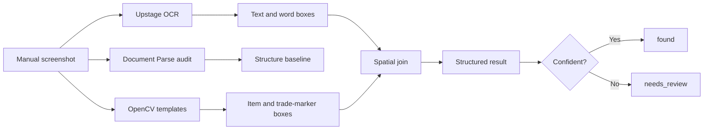

# RPG Progress OCR Logger

> A read-only multimodal pipeline that turns manually captured RPG inventory
> screenshots into reviewable progress records.

Game inventory screens contain useful data, but not in a form that can be
exported. This project combines **Upstage OCR**, **Document Parse**, and
**OpenCV** to identify a character, locate target items, distinguish tradeable
variants, and attach the correct quantity to each item.

The interesting part is not reading every number. It is deciding **which
number belongs to which visual object**.

## Pipeline



### Why three techniques?

| Technique | Responsibility | Why it is used |
| --- | --- | --- |
| Upstage OCR | Character ID, quantities, word coordinates | Provides text with bounding boxes for spatial association |
| Document Parse | Structure-aware comparison baseline | Tests whether document structure alone is sufficient for a game UI |
| OpenCV | Item icons, colors, trade marker | Recovers meaning that is visual rather than textual |

Document Parse is deliberately kept as an audit path. The runtime scanner uses
OCR word coordinates because an inventory cell is a visual layout problem, not
a conventional document table.

## What It Handles

- Character ID extraction from a resolution-relative region
- Crest and gem-power icon matching
- Tradeable normal gems identified by a trade-marker requirement
- Quantity association through an icon-to-OCR spatial join
- Template scaling between `960x540` and `1280x720` captures
- Explicit `needs_review` output when a quantity is missing or ambiguous
- CSV export for Google Sheets-compatible records

## Validation Snapshot

Tests were run on manually captured local screenshots, which are not published:

| Dataset | Result |
| --- | --- |
| Initial `960x540` screenshots | 9 of 10 target values found; 1 flagged for review |
| New `1280x720` crest/gem-power screenshot | 3 of 4 found; 1 flagged for review |
| New `1280x720` normal-gem screenshot | 6 of 6 found |

The unresolved case was a quantity that OCR did not return as a standalone word.
The pipeline intentionally reported `needs_review` instead of inventing a value.
These observations are from a small prototype dataset, not a general accuracy
benchmark.

## Quick Start

Requires Python 3.10 or newer.

```bash
python -m pip install -e ".[dev]"
python -m pytest
```

Run the offline parser with the included synthetic fixture:

```bash
rpg-progress-ocr-logger parse fixtures/sample_ocr_response.json \
  --out examples/progress_log.csv
```

Compare Upstage OCR and Document Parse on local images:

```bash
rpg-progress-ocr-logger audit-upstage examples/screenshot.png \
  --out-dir local_outputs
```

Scan one inventory image with an existing Upstage OCR response and local
templates:

```bash
rpg-progress-ocr-logger scan examples/screenshot.png \
  --ocr-json local_outputs/upstage_ocr/screenshot.json \
  --templates local_templates \
  --out local_outputs/scan.json
```

Create `.env` from `.env.example` before making an Upstage API request.

## Output

```json
{
  "source": "screenshot.png",
  "character_id": "sample-character",
  "items": [
    {
      "name": "unbound_ruby",
      "quantity": 45,
      "match_score": 0.91,
      "status": "found",
      "notes": ""
    }
  ]
}
```

## Repository Layout

```text
src/rpg_progress_ocr_logger/
  cli.py                 command-line entry point
  upstage_client.py      OCR and Document Parse API boundary
  inventory_scanner.py   template matching and spatial join
  parser.py              synthetic fixture parser
  sheets_export.py       CSV export
fixtures/                synthetic OCR response
tests/                   offline unit tests
docs/                    ethics and sample-data policy
```

Visual templates and real screenshots remain local. They may contain
copyrighted game UI or account-specific context, so `.gitignore` excludes them
from the public repository.

## Design Decisions

**Resolution-relative matching.** Templates and spatial thresholds scale from a
`960px` reference width. This preserved matching behavior when the emulator
capture changed to `1280px`.

**Trade marker before color.** A gem color identifies its type, but does not
prove it is tradeable. Normal gems are accepted as unbound only when the
trade-marker is detected in the same cell.

**Human review over false certainty.** A high icon score cannot compensate for
a missing OCR quantity. Partial evidence becomes `needs_review`.

## Ethical Boundary

This is screenshot post-processing, not gameplay automation.

- No login, clicking, combat, farming, movement, or account control
- No process memory, packet inspection, private API, or protected-file access
- Only screenshots manually supplied by the user are processed
- Ambiguous results remain visible for human review

See [docs/ethical-boundary.md](docs/ethical-boundary.md) and
[docs/sample-data-policy.md](docs/sample-data-policy.md).

## Current Limitations

- Templates must be prepared locally for the target UI version.
- Validation covers two resolutions and a small number of screenshots.
- OCR may omit visually rendered one-digit quantities.
- Direct Google Sheets API writing is not implemented; CSV export is available.
