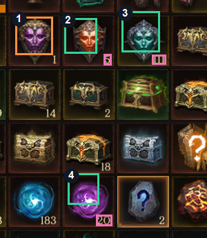
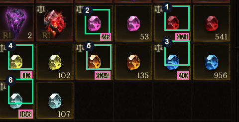

# RPG Progress OCR Logger

여러 캐릭터의 인벤토리 스크린샷에서 관심 재화의 수량을 읽고, 캐릭터별
진척도로 정리하기 위해 만든 읽기 전용 도구입니다.

이 프로젝트는 게임을 대신 플레이하거나 클라이언트를 조작하지 않습니다.
플레이가 끝난 뒤 사용자가 직접 캡처한 화면만 읽습니다.

## 왜 만들었나

캐릭터가 늘어나면서 실제로 번거로웠던 일은 플레이보다 결과를 기록하는
과정이었습니다. 캐릭터마다 인벤토리를 열고 문장, 보석 마력, 거래 가능한
일반 보석을 확인한 뒤 다시 표에 옮겨 적어야 했습니다.

처음에는 OCR로 화면의 숫자를 읽으면 금방 해결될 것이라 생각했습니다.
하지만 OCR 응답에는 인벤토리의 모든 숫자가 한꺼번에 들어왔고, 그 숫자가
어느 아이템의 수량인지는 알려주지 않았습니다.

예를 들어 `45`, `277`, `88`을 정확히 읽더라도 다음 질문은 그대로 남습니다.

- `45`가 루비 수량인지 다른 아이템의 수량인지
- 같은 색의 보석 중 어느 쪽이 거래 가능한 미귀속 보석인지
- 화면에는 `1`이 보이는데 OCR 응답에는 왜 숫자가 없는지

결국 이 문제는 단순한 문자 인식이 아니라 **텍스트 좌표와 시각적 대상을
연결하는 문제**였습니다.

## 해결 과정

### 1. OCR로 읽을 수 있는 것부터 확인

Upstage OCR에서 캐릭터 ID와 숫자뿐 아니라 각 단어의 bounding box를
받았습니다. 이 좌표가 있으면 아이템 아이콘 아래나 같은 인벤토리 셀에 있는
숫자를 후보로 좁힐 수 있습니다.

OCR이 읽은 숫자 자체는 대체로 정확했지만, 숫자만으로는 아이템 종류를 알 수
없었습니다. 그래서 OCR은 최종 판단기가 아니라 **텍스트와 위치를 제공하는
한 축**으로 두었습니다.

### 2. Document Parse가 게임 UI에도 도움이 되는지 비교

Document Parse는 문서의 표나 문단 구조를 이해하는 데 강점이 있으므로,
인벤토리 그리드도 구조화할 수 있는지 OCR 결과와 비교했습니다.

게임 화면은 일반 문서와 달랐습니다. 아이템 이름이 셀마다 적혀 있지 않고,
색상과 아이콘, 작은 거래 표식에 의미가 담겨 있었습니다. Document Parse가
텍스트를 추출할 수는 있어도, `이 숫자가 이 보석의 수량이다`라는 관계까지
안정적으로 복원하지는 못했습니다.

이 비교를 통해 Document Parse는 OCR과의 차이를 확인하는 감사 경로로 남기고,
실제 수량 연결에는 OCR 좌표와 컴퓨터 비전을 사용하기로 했습니다.

### 3. 템플릿 매칭으로 숫자의 주인을 찾기

OpenCV 템플릿 매칭으로 문장, 보석 마력, 일반 보석의 위치를 찾았습니다.
그다음 아이템 bounding box의 오른쪽 아래 또는 같은 셀 안에 있는 OCR 숫자를
선택했습니다.

```text
아이템 템플릿 위치
        +
OCR 숫자 위치
        ↓
거리와 셀 범위를 이용한 spatial join
        ↓
item + quantity
```

일반 보석에서는 색상만 비교하지 않았습니다. 같은 종류의 보석이라도 거래
가능 여부가 다르기 때문입니다. 먼저 셀 좌측 상단의 거래 가능 표식을 찾고,
그 셀 안에서 보석 종류와 수량을 판별했습니다.

```text
거래 가능 표식 확인
-> 표식이 속한 인벤토리 셀 계산
-> 셀 내부의 보석 템플릿 분류
-> 셀 하단 OCR 숫자 연결
```

### 4. 해상도가 달라지면서 생긴 오탐

처음 만든 템플릿은 `960x540` 스크린샷에서 잘 동작했습니다. 이후 앱플레이어
설정이 달라진 `1280x720` 화면에서는 같은 픽셀 크기로 비교할 수 없었습니다.

기준 화면 폭을 `960px`로 두고 현재 화면 폭과의 비율만큼 템플릿과 탐색
거리를 함께 확대했습니다. 이 과정에서 모든 템플릿을 화면 전체에 적용하면
비슷한 장식이 아이템으로 잡히는 문제도 확인했습니다.

실제 대상의 매칭 점수는 `0.96~0.99`, 다른 장식의 오탐은 `0.49~0.79`
구간에 모였습니다. 파일명에 따라 탐지기를 바꾸는 대신, 아이템이 화면에
존재한다고 볼 수 있는 임계값을 두어 오탐을 제외했습니다.

### 5. 화면에는 `1`이 있는데 OCR에는 없었던 경우

가장 흥미로웠던 실패는 영원의 전설 문장 수량 `1`이었습니다. 아이템
템플릿은 높은 점수로 찾아냈지만, Upstage OCR 응답에는 수량이 독립된
숫자 단어로 들어오지 않았습니다.

처음에는 아이콘이 존재하니 수량을 `1`로 간주할 수도 있다고 생각했습니다.
하지만 아이콘의 존재와 수량 `1`은 같은 사실이 아닙니다. 빈 슬롯 표현이나
다른 UI 변화가 생기면 잘못된 값을 조용히 기록할 수 있습니다.

현재는 다음 원칙을 따릅니다.

- 아이템과 OCR 수량을 모두 찾으면 `found`
- 아이템은 찾았지만 수량이 없으면 `needs_review`
- 높은 템플릿 점수만으로 수량을 추측하지 않음

짧은 단일 숫자가 OCR에서 누락되는 경우를 더 모은 뒤, 매칭된 셀의 수량
영역만 다시 확대해 읽는 fallback을 검토하고 있습니다. 이 fallback도
기존 OCR 값을 덮어쓰지 않고, 충분한 근거가 없으면 검토 대상으로 남기는
방향이 적절하다고 판단했습니다.

## 실제 탐지 결과

아래 이미지는 새로운 `1280x720` 화면에서 인벤토리 영역만 잘라낸 실제
검증 결과입니다. 캐릭터 ID와 전체 게임 화면은 공개 이미지에서 제외했습니다.

### 문장과 미귀속 보석 마력



- 초록색 박스: 아이템과 OCR 수량을 모두 찾은 경우
- 주황색 박스: 아이템은 찾았지만 OCR 수량이 없어 검토가 필요한 경우
- 자주색 박스: Upstage OCR이 숫자로 인식한 위치

| 번호 | 판별 결과 | 연결한 수량 | 템플릿 점수 | 상태 |
| ---: | --- | ---: | ---: | --- |
| 1 | 영원의 전설 문장 |  | 0.9739 | `needs_review` |
| 2 | 전설 문장 | 5 | 0.9835 | `found` |
| 3 | 희귀 문장 | 111 | 0.9747 | `found` |
| 4 | 미귀속 보석 마력 | 20 | 0.9938 | `found` |

1번 아이템 아래에는 실제로 `1`이 보이지만 OCR 응답에는 해당 숫자의
bounding box가 없었습니다. 화면을 보고 값을 채워 넣는 대신 빈 수량과
`needs_review`를 반환한 이유를 이 이미지에서 함께 확인할 수 있습니다.

### 거래 가능한 일반 보석



- 초록색 박스: 보석 템플릿이 매칭된 위치
- 자주색 박스: Upstage OCR이 숫자로 인식한 위치
- 번호: 아래 표의 탐지 결과와 이미지 연결

| 번호 | 판별 결과 | 연결한 수량 | 템플릿 점수 |
| ---: | --- | ---: | ---: |
| 1 | 미귀속 루비 | 471 | 0.9294 |
| 2 | 미귀속 전기석 | 26 | 0.9457 |
| 3 | 미귀속 사파이어 | 20 | 0.9594 |
| 4 | 미귀속 황수정 | 113 | 0.9632 |
| 5 | 미귀속 토파즈 | 634 | 0.9748 |
| 6 | 미귀속 남옥 | 166 | 0.9685 |

## 검증 결과

실제 스크린샷과 API 원문은 로컬에만 보관했습니다.

| 검증 데이터 | 결과 |
| --- | --- |
| 최초 `960x540` 화면 | 목표값 10개 중 9개 탐지, 1개 검토 필요 |
| 신규 `1280x720` 문장·보석 마력 화면 | 4개 중 3개 탐지, 1개 검토 필요 |
| 신규 `1280x720` 일반 보석 화면 | 미귀속 보석 6종 모두 탐지 |

아직 데이터가 적기 때문에 위 결과를 일반화된 정확도로 표현하지 않았습니다.
현재 확인한 범위와 실패 사례를 그대로 기록한 값입니다.

## 테스트를 실제 이미지와 분리한 이유

실제 게임 스크린샷과 잘라낸 템플릿을 테스트 fixture로 올리면 재현은 쉽지만,
계정 정보와 게임 UI 저작물이 Public 저장소에 남습니다.

대신 테스트 실행 중 작은 합성 이미지와 OCR 좌표를 생성합니다. 이 방식으로
실제 에셋 없이도 파이프라인의 판단 규칙을 검증할 수 있습니다.

- 캐릭터 ID 영역 선택
- Upstage OCR bounding box 변환
- 아이템과 수량의 spatial join
- 수량 누락 시 `needs_review`
- 거래 표식이 있는 일반 보석 판별
- 템플릿이 없을 때의 오탐 방지
- `960px`과 `1280px` 화면의 크기 보정
- OCR 레코드의 누락 필드 처리

```bash
python -m pytest
```

현재 결과는 **9 passed**입니다.

## Google Sheets에는 어떻게 기록할 것인가

현재 구현은 스캔 결과를 JSON과 Google Sheets에서 가져올 수 있는 CSV로
저장합니다. 다음 단계에서는 여러 화면의 결과를 캐릭터 ID로 합친 뒤,
**한 캐릭터의 한 번의 캡처 세션을 한 행으로 기록**하려고 합니다.

열은 사용 중인 관심 재화로 고정합니다.

```text
기록시각
캐릭터 ID
영원의 전설 문장
전설 문장
희귀 문장
미귀속 보석 마력
미귀속 전기석
미귀속 루비
미귀속 황수정
미귀속 토파즈
미귀속 사파이어
미귀속 남옥
검토 상태
```

각 스크린샷은 같은 캐릭터 ID와 캡처 세션을 기준으로 하나의 임시 레코드에
합쳐집니다. 아이템 이름은 정해진 열 이름으로 매핑되므로, 스크린샷에서
아이템 순서가 달라져도 같은 열에 기록됩니다.

초기 검증 화면의 값을 예로 들면 자동 추출 직후에는 다음과 같습니다.

| 캐릭터 ID | 영원의 전설 문장 | 전설 문장 | 희귀 문장 | 미귀속 보석 마력 | 전기석 | 루비 | 황수정 | 토파즈 | 사파이어 | 남옥 | 검토 상태 |
| --- | ---: | ---: | ---: | ---: | ---: | ---: | ---: | ---: | ---: | ---: | --- |
| 게임캐릭터ID | 2 |  | 180 | 58 | 71 | 45 | 88 | 89 | 22 | 84 | 전설 문장 수량 확인 필요 |

전설 문장 아이콘은 찾았지만 OCR이 `1`을 반환하지 않았기 때문에 빈칸으로
둡니다. 사용자가 화면을 확인해 `1`을 승인하면 같은 행이 다음처럼 보정됩니다.

| 캐릭터 ID | 영원의 전설 문장 | 전설 문장 | 희귀 문장 | 미귀속 보석 마력 | 전기석 | 루비 | 황수정 | 토파즈 | 사파이어 | 남옥 | 검토 상태 |
| --- | ---: | ---: | ---: | ---: | ---: | ---: | ---: | ---: | ---: | ---: | --- |
| 게임캐릭터ID | 2 | 1 | 180 | 58 | 71 | 45 | 88 | 89 | 22 | 84 | 확인 완료 |

이 구조를 선택한 이유는 캐릭터별 재화량을 행 단위로 비교하기 쉽고,
다음 캡처에서 이전 행과의 차이를 계산하기도 편하기 때문입니다.

아직 Google Sheets API 직접 쓰기는 구현하지 않았습니다. 인증 정보 관리,
동일 캡처의 중복 입력 방지, 부분 실패 시 재시도 방식을 함께 정한 뒤
추가할 예정이며 진행 내용은
[Issue #4](https://github.com/aibc24-hwirim/rpg-progress-ocr-logger/issues/4)에서
관리합니다.

## 실행 방법

Python 3.10 이상이 필요합니다.

```bash
python -m pip install -e ".[dev]"
python -m pytest
```

합성 OCR fixture를 CSV로 변환합니다.

```bash
rpg-progress-ocr-logger parse fixtures/sample_ocr_response.json \
  --out examples/progress_log.csv
```

로컬 이미지에서 Upstage OCR과 Document Parse 결과를 비교합니다.

```bash
rpg-progress-ocr-logger audit-upstage examples/screenshot.png \
  --out-dir local_outputs
```

OCR 응답과 로컬 템플릿으로 인벤토리 한 장을 분석합니다.

```bash
rpg-progress-ocr-logger scan examples/screenshot.png \
  --ocr-json local_outputs/upstage_ocr/screenshot.json \
  --templates local_templates \
  --out local_outputs/scan.json
```

Upstage API를 호출하기 전 `.env.example`을 참고해 로컬 `.env`를 작성합니다.

## 출력 예시

```json
{
  "source": "screenshot.png",
  "character_id": "sample-character",
  "items": [
    {
      "name": "unbound_ruby",
      "quantity": 45,
      "match_score": 0.91,
      "status": "found",
      "notes": ""
    }
  ]
}
```

## 저장소 구조

```text
src/rpg_progress_ocr_logger/
  cli.py                 CLI 진입점
  upstage_client.py      OCR / Document Parse API 경계
  inventory_scanner.py   템플릿 매칭과 spatial join
  parser.py              합성 fixture 파서
  sheets_export.py       CSV 출력
fixtures/                합성 OCR 응답
tests/                   오프라인 단위·통합 테스트
docs/                    윤리 범위와 샘플 데이터 정책
```

## 윤리적 경계

처음에는 반복 작업을 줄인다는 이유로 게임 조작까지 확장하기 쉬운 문제라고
생각했습니다. 그래서 구현 범위를 스크린샷 후처리에 고정했습니다.

- 사용자가 직접 캡처한 화면만 입력으로 받음
- 로그인, 클릭, 전투, 파밍, 이동, 계정 전환을 수행하지 않음
- 프로세스 메모리, 패킷, 비공개 API, 보호 파일에 접근하지 않음
- 판단 근거가 부족한 값은 사람의 검토를 거침

자세한 기준은 [윤리적 경계](docs/ethical-boundary.md)와
[샘플 데이터 정책](docs/sample-data-policy.md)에 정리했습니다.

## 남아 있는 과제

- 한 자리 수량이 OCR에서 빠지는 사례에 대한 제한적 재인식
- UI 배율과 버전 차이를 분리하기 위한 템플릿 프로필
- 더 다양한 화면 배치와 해상도에서의 회귀 테스트
- Google Sheets wide-table 직접 기록과 중복 방지
